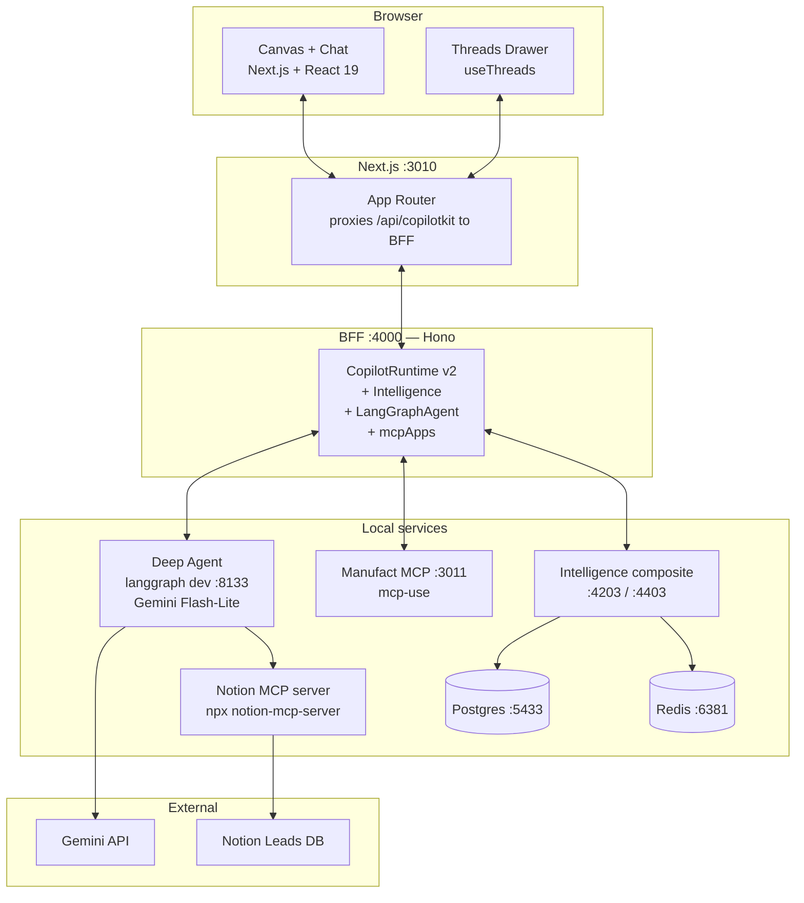
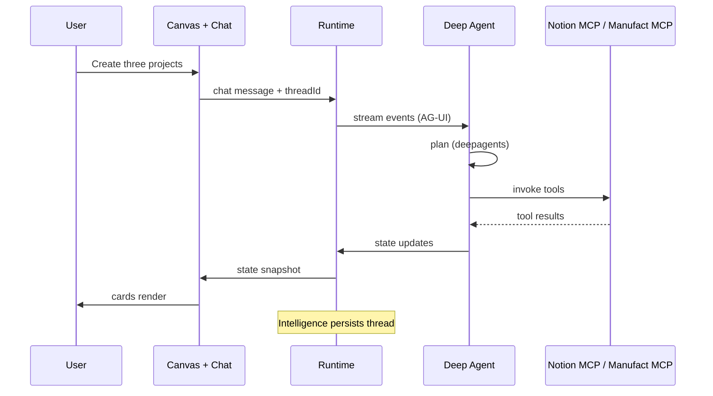

# Generative UI Global Hackathon: Agentic Interfaces Starter Kit


A complete AI agent starter wired for a **Notion lead-capture / CRM-lite** usecase: durable conversation threads, an agent-driven canvas of lead cards, bidirectional sync with a Notion "Leads" database, and a deployable MCP App — all in one repo.

**Built on:** [CopilotKit Intelligence](https://docs.copilotkit.ai/learn/intelligence-platform) · [LangChain Deep Agents](https://github.com/langchain-ai/deepagents) · [Gemini](https://ai.google.dev/gemini-api/docs) · [Notion MCP](https://github.com/makenotion/notion-mcp-server) · [Manufact (mcp-use)](https://manufact.com)

---

## About this Starter Kit

- **Persistent threads.** Every conversation is named, listed in the sidebar, and survives reloads, restarts, and resumes mid-run.
- **An agent-driven canvas.** Lead cards (entities), follow-up notes, and pipeline charts the AI can create, edit, and organize while you watch.
- **Real integrations via MCP.** Notion Leads database sync out of the box through the official Notion MCP server (mcp-use); swap to any other MCP server with one config edit.
- **A Manufact MCP server.** A third agent surface that runs in Claude or ChatGPT, deployable with one command.
- **Generative UI primed.** Generative UI Components are wired so you can stream Gemini-rendered components without re-plumbing.

https://github.com/user-attachments/assets/6f44cf84-e485-4c26-8703-481e0c9c2c54

### CopilotKit

CopilotKit connects your app's logic, state, and user context to the AI agents that deliver the animated and interactive part of your app experience — across both embedded UIs and fully headless interfaces. The kit ships with **CopilotKit Intelligence** wired in, giving you durable conversation threads (Postgres-backed), a runtime that bridges your frontend to any LangGraph agent, and built-in support for generative UI and MCP App composition.

[More about CopilotKit ->](https://docs.copilotkit.ai)

### LangChain Deep Agents

LangChain Deep Agents is a Python framework that gives an LLM agent built-in planning, sub-agent dispatch, a virtual filesystem, and a TODO loop — the patterns popularized by Claude Code and Manus, packaged as a `create_deep_agent(...)` call on top of LangGraph. The kit uses Deep Agents as the brain behind the canvas: a single prompt like "import the workshop leads and draft outreach to the top 5" triggers a multi-step plan that the agent executes tool-by-tool while you watch the cards appear.

[More about Deep Agents ->](https://github.com/langchain-ai/deepagents)

### Gemini

Gemini 3.1 Flash-Lite is Google's high-volume workhorse in the Gemini 3 family — fast, cheap, and tool-calling-capable. The kit defaults to **`gemini-3.1-flash-lite`** for chat — pick up an API key from [Google AI Studio](https://aistudio.google.com), drop it into `.env`, and you're done. Need a more reasoning-heavy model? Swap to **Gemini 3 Pro Preview** or **Gemini 3 Flash** with a one-line edit in `apps/agent/src/runtime.py` (`_gemini_llm`). Swapping to OpenAI, Anthropic, or any other LangChain-supported model is also a one-line edit (see [Switching to a different model](#switching-to-a-different-model) below).

[More about Gemini ->](https://ai.google.dev/gemini-api/docs)

### Notion MCP (via mcp-use)

The kit ships with a **Notion Leads database demo** wired through the official [Notion MCP server](https://github.com/makenotion/notion-mcp-server) (`@notionhq/notion-mcp-server`), called from Python via [mcp-use](https://manufact.com/mcp-use). MCP is the open protocol for connecting LLMs to tools — Anthropic publishes it, and Notion ships a first-party server. Swap to any other MCP server (Linear, Slack, GitHub, Google Drive, …) by changing one config dict in `apps/agent/src/notion_mcp.py` and updating the prompt's `INTEGRATION_PROMPT`.

[More about MCP ->](https://modelcontextprotocol.io)

### Manufact / mcp-use

The kit's `apps/mcp/` package is an MCP server built with [`mcp-use`](https://manufact.com/mcp-use), an open-source TypeScript framework for building MCP servers and MCP Apps. `npm run dev:mcp` gives you a full development environment with a local Inspector and support for hot reload for quick iteration. Easily deploy the server to [Manufact Cloud](https://manufact.com) with `npm run -w mcp deploy`.

[More about Manufact ->](https://manufact.com)

---

## Try it out — CopilotKit Intelligence

Here's how to try out 🪁 **CopilotKit Intelligence**:

1. Run `npx @copilotkit/cli@latest init` and select **Intelligence** when prompted (see the canonical flow at [docs.copilotkit.ai/threads](https://docs.copilotkit.ai/threads))
2. Drop a Gemini API key in **both** `.env` and `apps/agent/.env` (see [Get a Gemini API key](#get-a-gemini-api-key-required) below — OpenAI works if you swap the model back), plus a Notion integration token + database id (see [Notion MCP setup](#notion-mcp-setup-notion-lead-form-demo)).
3. Run `npm install` then `npm run dev` (or `npm run dev:full` if you want the MCP demo too)

> **⚠ Don't skip step 3.** `npm run dev` runs a pre-flight check (`scripts/check-env.sh`) before booting anything — it'll fail loudly with a numbered list of any missing keys, an unreachable Notion database, or a Docker daemon that isn't running. Fix everything it lists, re-run, and you're off. See [Troubleshooting](#troubleshooting) at the bottom for fixes for each failure mode.

Please give us feedback on your experience with it! 😄

---

## Get a Gemini API key (required)

This kit defaults to **Gemini 3.1 Flash-Lite**. You need a Gemini API key for chat to work.

1. Go to [aistudio.google.com](https://aistudio.google.com) and sign in with a Google Account.
2. In the left sidebar, click **Get API key**.
3. Click **Create API key** — choose **Create API key in new project** or **in existing project**.
4. Copy the key (starts with `AIza`). You can retrieve it later from the same dashboard.

Full docs: https://ai.google.dev/gemini-api/docs/api-key

Then drop it into both env files:

```bash
# .env (root, used by the BFF + Next.js)
GEMINI_API_KEY=AIza...

# apps/agent/.env (used by langgraph dev)
GEMINI_API_KEY=AIza...
```

Prefer a different model (OpenAI, Anthropic, Ollama)? See [**Switching to a different model**](#switching-to-a-different-model) below.

### Switching to a different model

This kit ships **Gemini 3.1 Flash-Lite + deepagents** as the default. Two
pre-wired Gemini runtimes are selectable via the `AGENT_RUNTIME` env var —
no code edit needed:

| `AGENT_RUNTIME`        | Model                   | Planner                          |
|------------------------|-------------------------|----------------------------------|
| `gemini-flash-deep`    | `gemini-3.1-flash-lite` | `deepagents`                     |
| `gemini-flash-react`   | `gemini-3.1-flash-lite` | `langchain.create_agent` (react) |

Set in **both** `.env` and `apps/agent/.env` (the agent reads its own copy):

```bash
AGENT_RUNTIME=gemini-flash-deep
```

A third runtime (`claude-sonnet-4-6-react`) is also wired in
[`apps/agent/src/runtime.py`](apps/agent/src/runtime.py) (`_build_claude_react`) if
you'd rather run Claude — set `ANTHROPIC_API_KEY` in `apps/agent/.env` and flip
`AGENT_RUNTIME` to it. Use it as a template for any other LangChain
provider.

Restart the agent (`npm run dev:agent`) and you should see
`[runtime] AGENT_RUNTIME=...` in the agent log.

Want a different Gemini tier (`gemini-3-pro-preview`, `gemini-3-flash`) or
a different provider entirely (OpenAI, etc.)? Edit
`apps/agent/src/runtime.py` — `_gemini_llm()` is the single place the model id
lives, and `_build_*` factories show the LangChain provider import pattern
to copy for a new provider. Re-run `cd agent && uv sync` if you add a new
LangChain integration package.

---

## Notion MCP setup (Notion lead-form demo)

The kit calls Notion through the official [Notion MCP server](https://github.com/makenotion/notion-mcp-server) — a standalone process spawned on demand via `npx -y @notionhq/notion-mcp-server`. Auth is a single Notion integration token plus an explicit per-database share. No global install, no OAuth flow, no third-party broker.

> **Sample database.** The kit is wired against an "AI Workshop Provider Community" lead-form database. Schema and seed rows live in two places — pick whichever's easier for you:
>
> - **Public reference (read-only):** [view in Notion](https://www.notion.so/a274791c4e1e826d882d01562af74de9?v=0e04791c4e1e83ca834988083174d19e&source=copy_link) — duplicate it into your workspace to get an editable copy.
> - **Re-importable export in this repo:** [`docs/notion-leads-sample/ai-workshop-provider-community.zip`](docs/notion-leads-sample/ai-workshop-provider-community.zip) — in Notion, **Settings → Workspace → Import → Notion (CSV/ZIP)** and upload this file. Quick-look CSV alongside it: [`ai-workshop-provider-community.csv`](docs/notion-leads-sample/ai-workshop-provider-community.csv).

1. Create a Notion integration: go to https://notion.so/my-integrations → **New integration** → name it (e.g. "Hackathon kit") → copy the **Internal Integration Token**.
2. Open the Notion database you want to read from — either the sample above (duplicated into your workspace) or your own database with the same shape.
3. **Share the database with your integration**: open the database in Notion → click the `...` menu (top-right) → **Connections** → add the integration you just created. *Notion's per-database access model means a fresh token sees zero databases until it's been shared into them — this is the most common point of failure.*
4. Paste both into `apps/agent/.env` (and `.env`):

   ```bash
   NOTION_TOKEN=<paste the Internal Integration Token>
   NOTION_LEADS_DATABASE_ID=<paste the database id from its Notion URL>
   ```

5. Restart the agent. Try: **"Import the workshop leads."**

To use a different MCP server (Linear, Slack, GitHub, …), edit `apps/agent/src/notion_mcp.py` — replace the `mcpServers` config dict and update `mcp_query_data_source` / friends to call the new server's tool names. Then edit `apps/agent/src/prompts.py` (`INTEGRATION_PROMPT`) so the agent knows the new vocabulary.

---

## Manufact and mcp-use setup

The starter ships with a [mcp-use](https://manufact.com/mcp-use) MCP server in `apps/mcp/`. Run it alongside the rest of the stack:

### Run it locally

```bash
npm run dev:full
```

This adds the MCP leg on `:3011`. Open `http://localhost:3011/inspector` to test your tools and widgets interactively with the built-in Inspector.

### Test it in Claude / ChatGPT (no deploy)

Start the dev server with a built-in tunnel to get a public HTTPS URL instantly — no deployment needed:

```bash
npm run -w mcp dev -- --tunnel
```

This opens a public HTTPS URL like `https://<subdomain>.local.mcp-use.run/mcp`. Add it as a remote MCP server:

- **Claude:** Settings → Integrations → Add integration → paste URL
- **ChatGPT:** Settings → Connectors → Add MCP server → paste URL

Smoke-test prompts (sample data is baked into each widget — no setup needed):
- "Show me the workshop lead list." → `show-lead-list`
- "Show the workshop demand breakdown." → `show-lead-demand`
- "Show me the lead pipeline." → `show-lead-pipeline`

### Deploy to Manufact Cloud

```bash
# Login to Manufact Cloud
npx @mcp-use/cli login

# Deploy
npm run -w mcp deploy
```

Live at `https://<your-slug>.run.mcp-use.com/mcp` and managed from [manufact.com/cloud](https://manufact.com/cloud).

Once deployed, point the runtime at it by setting `MCP_SERVER_URL` in `.env`.

### Want to start with a fresh server?

The kit's `apps/mcp/` is hand-authored to fit the workspace (port `3011`, workspace-aware scripts, kit-specific demo widget). If you'd rather scaffold a brand-new MCP server from scratch use the official `create-mcp-use-app` CLI:

```bash
npx create-mcp-use-app@latest my-mcp-server
cd my-mcp-server && npm install && npm run dev
```

See the [create-mcp-use-app docs](https://manufact.com/docs/typescript/getting-started/quickstart) for full options.

---

## Vibe coding

The kit ships with skills pre-installed for Cursor, Claude Code, and any agent reading `.agent/`. Open the project in your coding tool and the skills are picked up automatically — no extra setup. They teach the agent CopilotKit's v2 API surface, MCP App authoring patterns, and the kit's own conventions.

```
.
├── .agent/skills/      ← agent-tool-agnostic (read by any agent following the AGENTS.md convention)
├── .claude/skills/     ← Claude Code
└── .cursor/skills/     ← Cursor
```

Each directory contains the same set of 11 skills (8 from [CopilotKit/skills](https://github.com/CopilotKit/skills), 3 from the Manufact reference): `copilotkit-{setup, develop, integrations, debug, upgrade, contribute, agui, self-update}` plus `mcp-builder`, `mcp-apps-builder`, `chatgpt-app-builder`.

To **update** the CopilotKit skills to the latest upstream:

```bash
npx skills add copilotkit/skills --full-depth -y
```

This refreshes `~/.claude/skills/copilotkit-*` and `~/.cursor/skills/copilotkit-*` from the canonical source. The kit's checked-in copies serve as a baseline so a fresh clone works without extra steps.

Reference docs:

- **CopilotKit Coding Agents:** https://docs.copilotkit.ai/coding-agents
- **CopilotKit Skills repo:** https://github.com/CopilotKit/skills
- **Agent Skills standard:** https://agentskills.io

---

## Demo prompts

Drop these into the chat to exercise each layer:

**Notion MCP (external integration)**
- "Import the workshop leads from Notion."

**Canvas (agent-driven UI)**
- "What's the most requested workshop?"
- "Open Ethan Moore."
- "Show me demand stats."

**Multi-step planning (Deep Agents)**
- "Draft an email to Ethan."

**Intelligence (durable threads)**
- "Open my last thread from earlier."
- *(Reload the browser. The conversation is still in the sidebar.)*

**Manufact MCP** *(requires `npm run dev:full` so the MCP server is running)*
- "Use the Manufact tool to show a sample widget."

---

## Architecture



> Default Intelligence/Postgres/Redis ports (`4201` / `4401` / `5432` / `6379`) are remapped via `.env` (`APP_API_HOST_PORT`, `REALTIME_GATEWAY_HOST_PORT`, `POSTGRES_HOST_PORT`, `REDIS_HOST_PORT`) so the kit boots cleanly on machines that already run another Intelligence stack. Override them in `.env` to use the originals.

**Why the BFF?** See [Why a separate BFF?](#why-a-separate-bff) below — the short version is that `@copilotkit/runtime/v2` bundles express transitively, which Next.js App Router can't tree-shake cleanly. Running the runtime as a Hono BFF and proxying through Next.js rewrites avoids the bundling hazard and keeps frontend URLs relative.



---

## Customization Guide

### Add a new card type

1. **Extend the type union** in `apps/frontend/src/lib/canvas/types.ts`:

   ```ts
   export type CardType = "project" | "entity" | "note" | "chart" | "yourNewCard";
   ```

2. **Define its data shape** in the same file (`YourNewCardData` interface).

3. **Render it** in `apps/frontend/src/components/canvas/CardRenderer.tsx` — add a branch for the new `type`.

4. **Tell the agent about it** in `apps/agent/src/prompts.py` — extend `FIELD_SCHEMA` inside `CANVAS_PROMPT`.

5. **Add a frontend tool** for at least one mutation. **Declare it on the React side only** — `useFrontendTool({ name, description, parameters: z.object({...}), handler })` in `apps/frontend/src/app/leads/page.tsx`. The runtime forwards it to the agent at run time. Don't add the same tool to `apps/agent/main.py`'s `tools=` list — Gemini rejects duplicate declarations with `"Duplicate function declaration found"`. The Python stubs in `apps/agent/src/canvas.py` are documentation only.

### Swap the integration MCP server

1. Find an MCP server for your new integration (the [MCP server registry](https://github.com/modelcontextprotocol/servers) has dozens — Linear, Slack, GitHub, Google Drive, etc.).
2. Edit `apps/agent/src/notion_mcp.py` → replace the `mcpServers` config dict (`command`, `args`, `env`) with the new server's. Update the wrapper functions (`mcp_query_data_source`, etc.) to call the new server's tool names.
3. Edit `apps/agent/src/notion_integration.py` → adjust the row-shaping logic if your new integration's response shape differs.
4. Edit `apps/agent/src/prompts.py` → `INTEGRATION_PROMPT`. Replace the Notion lead-form workflow prose with whatever the new integration expects (e.g. "When the user asks to file a bug, call `linear_create_issue` with…").
5. Restart the agent. Done.

### Add an MCP App tool

Three flavors depending on scope:

- **One more tool on the existing server.** Edit `apps/mcp/index.ts`, add another `server.tool({ ... }, async (input) => widget({ ... }))`. The runtime auto-discovers it on the next reload.
- **A second MCP server alongside the kit's.** Scaffold with `npx create-mcp-use-app@latest <name>` (the official Manufact CLI) and register it in `apps/bff/src/server.ts` under `mcpApps.servers[]`. Useful when you want a clean separation between domains.
- **A remote MCP server.** Set `MCP_SERVER_URL` in `.env` to someone else's deploy (Excalidraw, etc.) — the runtime swaps without code changes.

### Use runtime context from the UI

If you need to feed UI state (selected card, current view) into the agent's prompt, use `useAgentContext({ description, value })` from `@copilotkit/react-core/v2` inside a client component. The provided value is JSON-serialized and threaded into the agent's context on every turn — composing with the static `SYSTEM_PROMPT` defined in `apps/agent/src/prompts.py`.

---

## Threads / Intelligence walkthrough

The threads drawer surfaces every conversation the user has had with the agent on this machine. Threads live in the **Intelligence composite container** (Postgres-backed). When you reload, the active thread is restored.

- **Search** the loaded set client-side; click "Load more" or "Search older threads" to paginate further.
- **Archive** to hide threads you're done with; toggle the filter to view archived.
- **Restore** brings them back; **Delete** is permanent.
- **Theme toggle** in the drawer footer.

To wipe all threads and start fresh:

```bash
npm run dev:infra:down
docker volume rm $(docker volume ls -q | grep intelligence)
npm run dev:infra
```

---

## Manual setup (alternative to the CLI)

If you can't or don't want to use the CLI:

1. Get a license token: `npx copilotkit license -n hackathon-kit` — paste into `.env` as `COPILOTKIT_LICENSE_TOKEN`.
2. Bring up infra:
   ```bash
   docker compose up -d --wait
   ```
   This pulls `ghcr.io/copilotkit/intelligence/composite` and starts Postgres + Redis alongside.
3. Copy env templates: `cp .env.example .env` and `cp apps/agent/.env.example apps/agent/.env`. Paste your keys.
4. Install + run:
   ```bash
   npm install
   npm run dev
   ```

The intelligence env vars (`INTELLIGENCE_API_URL`, `INTELLIGENCE_GATEWAY_WS_URL`, `INTELLIGENCE_API_KEY`) match `deployment/docker-compose.yml`'s defaults — no manual editing needed for local dev.

---

## Removing Intelligence (Docker-free mode)

If you can't run Docker, strip Intelligence and use the kit as a plain CopilotKit + Deep Agents demo. Threads won't persist across reloads, but everything else works.

| Action | Path |
|---|---|
| Edit | `apps/bff/src/server.ts` — remove `intelligence`, `identifyUser`, `licenseToken` from the `CopilotRuntime` constructor (and the `CopilotKitIntelligence` import + instantiation) |
| Edit | `apps/frontend/src/app/leads/page.tsx` — remove `<ThreadsDrawer>` wrapper |
| Delete | `apps/frontend/src/components/threads-drawer/` |
| Delete | `deployment/docker-compose.yml`, `deployment/init-db/` |
| Edit | `.env.example` — remove `COPILOTKIT_LICENSE_TOKEN` and `INTELLIGENCE_*` |

---

## Available scripts

| Command | What it does |
|---|---|
| `npm run dev` | Boots infra, then UI + BFF + agent concurrently |
| `npm run dev:full` | Same as `dev` plus the MCP server |
| `npm run dev:infra` | Postgres + Redis + Intelligence composite |
| `npm run dev:infra:down` | Tear infra down |
| `npm run dev:ui` | Frontend only (Next.js, port 3010) |
| `npm run dev:bff` | CopilotKit runtime BFF only (Hono, port 4000) |
| `npm run dev:agent` | Agent only (`langgraph dev`, port 8133) |
| `npm run dev:mcp` | MCP server only (port 3011) |
| `npm run license` | Issue a CopilotKit license token |
| `npm run build` | Production build |

### Why a separate BFF?

The CopilotKit runtime (`@copilotkit/runtime/v2`) bundles express transitively, which Next.js can't tree-shake cleanly inside an App Router API route (the dynamic `require(mod)` in express's view engine breaks turbopack bundling). The kit instead runs the runtime as a Hono BFF on port 4000, and Next.js rewrites proxy `/api/copilotkit/*` to `http://localhost:4000` so frontend code stays on relative URLs and there's no CORS to manage.

---

## Documentation

- **CopilotKit:** https://docs.copilotkit.ai
- **CopilotKit Intelligence:** https://docs.copilotkit.ai/learn/intelligence-platform
- **CopilotKit Coding Agents:** https://docs.copilotkit.ai/coding-agents
- **CopilotKit Skills (vibe coding):** https://github.com/CopilotKit/skills
- **LangChain Deep Agents:** https://github.com/langchain-ai/deepagents
- **Gemini API:** https://ai.google.dev/gemini-api/docs
- **Notion MCP server:** https://github.com/makenotion/notion-mcp-server
- **Model Context Protocol:** https://modelcontextprotocol.io
- **Manufact / mcp-use:** https://manufact.com/docs/typescript/getting-started/quickstart
- **Next.js:** https://nextjs.org/docs

---

## Prerequisites

- Node.js 20+
- Python 3.10+
- [uv](https://docs.astral.sh/uv/getting-started/installation/) for Python deps
- Docker (required for Intelligence — see [Removing Intelligence](#removing-intelligence-docker-free-mode) for the no-Docker path)
- A package manager: `pnpm` (recommended), `npm`, `yarn`, or `bun`
- API keys: Gemini (required), Notion integration token (required for the lead-form demo — see [Notion MCP setup](#notion-mcp-setup-notion-lead-form-demo)), CopilotKit license (issued by the CLI or `npm run license`)

> Lock files are gitignored so you can use any package manager. Generate one locally with your tool of choice.

---

## Troubleshooting

`npm run dev` runs `scripts/check-env.sh` before anything boots — most of the
problems below are caught there with the exact fix in the output. The table
maps every known failure mode to its fix; entries below it are the older
expanded explanations.

| Symptom | Cause | Fix |
|---|---|---|
| `npm run dev` aborts with "Docker isn't running" | Docker Desktop not started | Start Docker Desktop and re-run. The pre-flight retries automatically. |
| Pre-flight prints "GEMINI_API_KEY is unset (or a stub)" | Gemini key not pasted into `apps/agent/.env` | Get one at https://aistudio.google.com → Get API key, paste into `apps/agent/.env` (and `.env`). |
| Pre-flight prints "NOTION_TOKEN is unset" | Notion token not pasted | Create an integration at https://notion.so/my-integrations and paste the Internal Integration Token into `apps/agent/.env`. |
| Chat hangs forever, never replies | `GEMINI_API_KEY` not set when you skipped the pre-flight (e.g. ran `npm run dev:agent` directly) | Set it in `apps/agent/.env` and restart the agent. The agent now answers in <3s with a setup pointer when the key is missing instead of hanging. |
| Toast: "Run `npm run seed` to seed the default user" | Postgres `default` / `1_default` user not seeded | Run `npm run seed`. The BFF rewrites the upstream `threads_user_id_fkey` 500 into this hint automatically. |
| Notion health check returns "0 rows" or "shared with this integration" | Database not shared with your integration | Open the database in Notion → `...` menu → **Connections** → **+ Add connection** → pick your integration **directly** (not via parent-page inheritance — that's the most common gotcha). |
| `Could not find database with ID …` | Wrong `NOTION_LEADS_DATABASE_ID` *or* not shared | Both — verify by running `cd agent && uv run python -m src.notion_tools --check`. The output names which one is wrong. |
| `Failed to initialize thread` (raw error, no hint) | BFF couldn't reach Intelligence at all | `docker compose ps` should show `intelligence`, `postgres`, `redis` healthy; if not, `npm run dev:infra:down && npm run dev:infra`. |
| Empty canvas, no errors anywhere | Agent booted without the integration prompt | Restart the agent (`npm run dev:agent`). The boot log should print `[notion_health_check] db="…" rows=50 …`. |

<details>
<summary><strong>Threads don't persist across reloads</strong></summary>

Intelligence isn't running. Check:
- Docker is running.
- `docker compose ps` shows `intelligence`, `postgres`, `redis` healthy.
- `COPILOTKIT_LICENSE_TOKEN` is set in `.env`.
- The runtime route includes `intelligence: new CopilotKitIntelligence({...})`.

</details>

<details>
<summary><strong>Gemini quota exceeded</strong></summary>

Free tier is generous but not infinite. Either wait, switch to a paid Gemini key, or temporarily swap the model id in `apps/agent/src/runtime.py` (`_gemini_llm`) to `gemini-3-flash` (frontier-class quality) or `gemini-3-pro-preview` (more reasoning, slower) — each tier has its own quota.

</details>

<details>
<summary><strong>Agent says "I'm having trouble connecting to my tools"</strong></summary>

1. Is the agent running? Check the `agent` log line in your terminal — it should print `Application startup complete` and bind to `:8133`.
2. Is `GEMINI_API_KEY` set in `apps/agent/.env`?
3. Run `cd agent && uv run langgraph dev --port 8133` directly to see the actual error.

</details>

<details>
<summary><strong>Notion import returns 0 rows or "unauthorized"</strong></summary>

1. Verify `NOTION_TOKEN` is set in `apps/agent/.env` and starts with `secret_` or `ntn_`. Get one at https://notion.so/my-integrations.
2. **Share the database with your integration.** This is the most common point of failure — Notion's per-database access model means a fresh integration token sees zero databases until they're explicitly shared with it. In the database in Notion: `...` menu → **Connections** → add your integration.
3. Verify `NOTION_LEADS_DATABASE_ID` matches the database (paste it from the Notion URL, hyphens optional).
4. From `apps/agent/`, run `uv run python -c "from src.notion_integration import health_check; import json; print(json.dumps(health_check(), indent=2))"` to see the failure verbatim.

</details>

<details>
<summary><strong>Manufact tunnel won't bind</strong></summary>

The `--tunnel` flag needs network egress. If you're on a VPN or restrictive corporate network, deploy instead: `npm run -w mcp deploy`.

</details>

<details>
<summary><strong>Port already in use</strong></summary>

```bash
lsof -ti:3010 | xargs kill -9   # frontend (Next.js)
lsof -ti:4000 | xargs kill -9   # BFF (Hono runtime)
lsof -ti:8133 | xargs kill -9   # agent (langgraph dev)
lsof -ti:3011 | xargs kill -9   # mcp
lsof -ti:4203 | xargs kill -9   # intelligence app-api (default; APP_API_HOST_PORT in .env)
lsof -ti:4403 | xargs kill -9   # intelligence realtime gateway (REALTIME_GATEWAY_HOST_PORT)
```

</details>

<details>
<summary><strong>Intelligence container failed to start</strong></summary>

```bash
docker compose logs intelligence
```

Most common causes: license token missing/invalid, port collision on `:4203` / `:4403` / `:5433` / `:6381` (or whatever you set in `.env`), or Postgres failed to initialize. Try `npm run dev:infra:down` then `npm run dev:infra`.

</details>

<details>
<summary><strong>Python import errors after install</strong></summary>

```bash
cd agent
rm -rf .venv
uv venv
uv sync
```

</details>

---

## License

MIT.

---

> Built for the Generative UI Global Hackathon: Agentic Interfaces.
