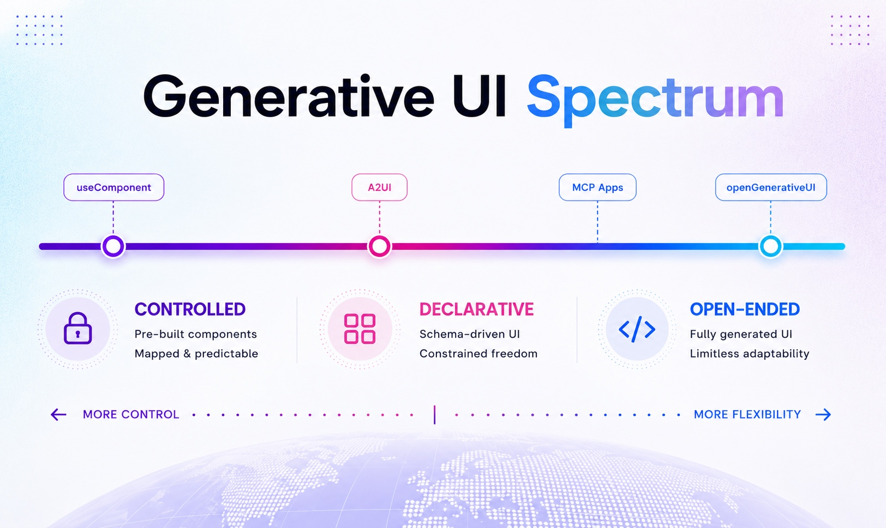

# Generative UI Global Hackathon: Agentic Interfaces Starter Kit


Welcome to the **Generative UI Global Hackathon: Agentic Interfaces**! This starter kit gives you a complete AI-powered application with durable conversation threads, an agent-driven canvas, real-world MCP integrations, and a deployable MCP App — wired up with CopilotKit, LangChain Deep Agents, Gemini, A2UI, Notion MCP (via mcp-use), Manufact, and Daytona.

## About this starter

This is a starter template for building agentic interfaces using CopilotKit, LangChain Deep Agents, Gemini, and A2UI. It provides a modern Next.js application with an integrated LangGraph Deep Agent that manages a visual canvas of interactive cards with real-time AI synchronization and external tool integrations (a Notion "Leads" database, for this example) through MCP. A second deployable MCP server, built on mcp-use, gives the agent a third surface that runs natively in Claude or ChatGPT.

This is an example application that we built to help you get started quickly. Everything you see can be customized, replaced, augmented, or built upon.

https://github.com/user-attachments/assets/6f44cf84-e485-4c26-8703-481e0c9c2c54

- **Persistent threads.** Every conversation is named, listed in the sidebar, and survives reloads, restarts, and resumes mid-run.
- **Agent-driven canvas.** Lead cards, follow-up notes, and pipeline charts the AI can create, edit, and organize while you watch.
- **Real integrations via MCP.** Notion Leads database sync out of the box; swap to any other MCP server with one config edit.
- **Deployable MCP server.** A third agent surface that runs in Claude or ChatGPT, deployable with one command.
- **Generative UI primed.** Stream Gemini-rendered components without re-plumbing.

---

## Generative UI



"Generative UI" describes any AI-driven interface that the agent **chooses, composes, or writes at runtime**. Approaches sit on a spectrum — from **more control** on one end to **more flexibility** on the other — and most real apps mix several tiers.

### Controlled (`useComponent`)

The highest level of control. The developer provides the agent with a set of predefined React components, and the agent selects the appropriate one and populates it with props. This ensures the interface stays on-brand and pixel-perfect, making it ideal for standard, repeatable application workflows. See [Display Components](https://docs.copilotkit.ai/generative-ui/your-components/display-only) in the CopilotKit docs.

### Declarative (`A2UI`)

Utilizing the [A2UI](https://a2ui.org/) specification, this method uses a schema to map agent outputs to a catalog of renderers. It offers a balance between control and flexibility, allowing the agent to handle more varied UI layouts without requiring a unique tool for every single component. It is particularly effective for the "long tail" of user interactions. See [A2UI](https://docs.copilotkit.ai/generative-ui/a2ui) in the CopilotKit docs.

### Open-ended (`MCP Apps`, `openGenerativeUI`)

The "Wild West" of generative UI — the agent generates raw HTML that is rendered within a secure, sandboxed double-iframe. While it is the most flexible — enabling the creation of disposable, data-grounded interfaces on the fly — it is the hardest to style consistently and can behave unpredictably. See [opengenerativeui.copilotkit.ai](https://opengenerativeui.copilotkit.ai/) for a live demo, and the CopilotKit docs on [MCP Apps](https://docs.copilotkit.ai/generative-ui/mcp-apps) and [Open Generative UI](https://docs.copilotkit.ai/generative-ui/open-generative-ui).

This kit is wired for all three: the canvas surface uses controlled cards for lead entities, A2UI streams declarative components from Gemini, and the deployable MCP server in `apps/mcp/` extends the same agent into Claude and ChatGPT's open-ended generative UI surface.

**Go deeper:**

- 🎥 Talk — [The Generative UI spectrum](https://www.youtube.com/watch?v=y4lln0yGMSE)
- 📝 Article — [CopilotKit on Generative UI](https://x.com/CopilotKit/status/2047327612163293286)

---

## Stack

### CopilotKit

CopilotKit connects your app's logic, state, and user context to the AI agents that deliver the animated and interactive part of your app experience — across both embedded UIs and fully headless interfaces. The kit ships with **CopilotKit Intelligence** wired in, giving you durable conversation threads (Postgres-backed), a runtime that bridges your frontend to any LangGraph agent, and built-in support for generative UI and MCP App composition.

[More about CopilotKit ->](https://docs.copilotkit.ai)

### LangChain Deep Agents

LangChain Deep Agents is a Python framework that gives an LLM agent built-in planning, sub-agent dispatch, a virtual filesystem, and a TODO loop — the patterns popularized by Claude Code and Manus, packaged as a `create_deep_agent(...)` call on top of LangGraph. The kit uses Deep Agents as the brain behind the canvas: a single prompt like "import the workshop leads and draft outreach to the top 5" triggers a multi-step plan that the agent executes tool-by-tool while you watch the cards appear.

[More about Deep Agents ->](https://github.com/langchain-ai/deepagents)

### Gemini

Gemini 3.1 Flash-Lite is Google's high-volume workhorse in the Gemini 3 family — fast, cheap, and tool-calling-capable. The kit defaults to **`gemini-3.1-flash-lite`** for chat — pick up an API key from [Google AI Studio](https://aistudio.google.com), drop it into `.env`, and you're done. Need a more reasoning-heavy model? Swap to **Gemini 3 Pro Preview** or **Gemini 3 Flash** with a one-line edit in `apps/agent/src/runtime.py` (`_gemini_llm`). Swapping to OpenAI, Anthropic, or any other LangChain-supported model is also a one-line edit (see [Switching to a different model](dev-docs/model-switching.md)).

[More about Gemini ->](https://ai.google.dev/gemini-api/docs)

### A2UI

[A2UI](https://a2ui.org/) is a protocol for agent-driven interfaces — it lets AI agents generate rich, interactive UI that renders natively across web, mobile, and desktop **without executing arbitrary code**. That sandboxed-by-default model pairs well with the kit's generative UI surface: Gemini emits A2UI components, the renderer paints them, and the agent never ships executable code to the client. Browse the [custom catalog](https://a2ui-composer.ag-ui.com/custom-catalog) for component examples.

[More about A2UI ->](https://github.com/google/A2UI)

### Notion MCP (via mcp-use)

The kit ships with a **Notion Leads database demo** wired through the official [Notion MCP server](https://github.com/makenotion/notion-mcp-server) (`@notionhq/notion-mcp-server`), called from Python via [mcp-use](https://manufact.com/mcp-use). MCP is the open protocol for connecting LLMs to tools — Anthropic publishes it, and Notion ships a first-party server. Swap to any other MCP server (Linear, Slack, GitHub, Google Drive, …) by changing one config dict in `apps/agent/src/notion_mcp.py` and updating the prompt's `INTEGRATION_PROMPT`.

[More about MCP ->](https://modelcontextprotocol.io)

### Manufact / mcp-use

The kit's `apps/mcp/` package is an MCP server built with [`mcp-use`](https://manufact.com/mcp-use), an open-source TypeScript framework for building MCP servers and MCP Apps. `npm run dev:mcp` gives you a full development environment with a local Inspector and support for hot reload for quick iteration. Easily deploy the server to Manufact Cloud with `npm run -w mcp deploy`.

[More about Manufact ->](https://manufact.com)

### Daytona

[Daytona](https://www.daytona.io/) is a secure and elastic infrastructure runtime for AI-generated code execution and agent workflows. Sandboxes spin up in under 90ms with full isolation — dedicated kernel, filesystem, network stack, and allocated vCPU/RAM/disk — and run any Python, TypeScript, or JavaScript code. Built on OCI/Docker compatibility with stateful environment snapshots, it's a natural fit when an agent in this kit needs to execute generated code or persist a workspace across sessions. Agents and developers interact with sandboxes programmatically through Daytona's SDKs, API, and CLI.

[More about Daytona ->](https://github.com/daytonaio/daytona)

---

## Run it locally

1. Run `npx @copilotkit/cli@latest init` and select **Intelligence** when prompted.
2. Drop a Gemini API key into **both** `.env` and `apps/agent/.env`, plus a Notion integration token + database id. See [dev-docs/setup.md](dev-docs/setup.md) for keys + Notion sharing steps.
3. Run `npm install` then `npm run dev` (or `npm run dev:full` to include the MCP server).

> `npm run dev` runs a pre-flight check (`scripts/check-env.sh`) before booting anything — it'll fail loudly with a numbered list of any missing keys, an unreachable Notion database, or a Docker daemon that isn't running. Fix what it lists, re-run, and you're off. See [dev-docs/troubleshooting.md](dev-docs/troubleshooting.md) for fixes per failure mode.

Please give us feedback on your experience with it!

---

## Vibe coding

The kit ships with skills pre-installed for Cursor, Claude Code, and any agent reading `.agent/`. Open the project in your coding tool and they're picked up automatically — no extra setup. They teach your coding agent CopilotKit's v2 API surface, MCP server / MCP App authoring patterns, and this kit's own conventions.

```
.
├── .agent/skills/   ← agent-tool-agnostic (read by any agent following the AGENTS.md convention)
├── .claude/skills/  ← Claude Code
└── .cursor/skills/  ← Cursor
```

Each directory carries the same set of 11 skills:

- **CopilotKit (8):** `copilotkit-{setup, develop, integrations, debug, upgrade, contribute, agui, self-update}` — from [CopilotKit/skills](https://github.com/CopilotKit/skills).
- **MCP (3):** `mcp-builder`, `mcp-apps-builder`, `chatgpt-app-builder` — from the Manufact reference. They cover authoring an MCP server (the open protocol Anthropic publishes for wiring LLMs to external tools — the same protocol the kit's Notion integration uses) and packaging it as an MCP App that runs natively in Claude or ChatGPT.

To **update** the CopilotKit skills to the latest upstream:

```bash
npx skills add copilotkit/skills --full-depth -y
```

### Connect to the CopilotKit docs MCP server

CopilotKit also exposes a hosted MCP server that gives your coding agent live access to the latest CopilotKit reference material — handy when the checked-in skills lag upstream or you want to ask the docs questions interactively.

**MCP endpoint:** `https://mcp.copilotkit.ai/mcp`

**Claude Web** (Anthropic's web app — attaches MCP servers via Connectors):

1. Open [Claude](https://claude.ai/), click your user in the bottom-left of the chat box, and select **Settings**.
2. In the left-hand menu, select **Connectors** (or jump straight to the [Connectors settings page](https://claude.ai/settings/connectors)).
3. Click **Add custom connector**.
4. **Name:** `CopilotKit`
5. **URL:** `https://mcp.copilotkit.ai/mcp`
6. Click **Add**.

Setup for Claude Code, Cursor, ChatGPT, and other coding agents is documented at [docs.copilotkit.ai/coding-agents](https://docs.copilotkit.ai/coding-agents).

Reference docs: [CopilotKit Coding Agents](https://docs.copilotkit.ai/coding-agents) · [CopilotKit Skills repo](https://github.com/CopilotKit/skills) · [Agent Skills standard](https://agentskills.io).

---

## Documentation

Deeper guides live in [`dev-docs/`](dev-docs/):

- [Setup](dev-docs/setup.md) · [Model switching](dev-docs/model-switching.md) · [MCP server](dev-docs/mcp-server.md)
- [Architecture](dev-docs/architecture.md) · [Customization](dev-docs/customization.md) · [Threads / Intelligence](dev-docs/threads.md)
- [Scripts](dev-docs/scripts.md) · [Demo prompts](dev-docs/demo-prompts.md) · [Troubleshooting](dev-docs/troubleshooting.md)

## License

MIT.

---

> Built for the Generative UI Global Hackathon: Agentic Interfaces.
